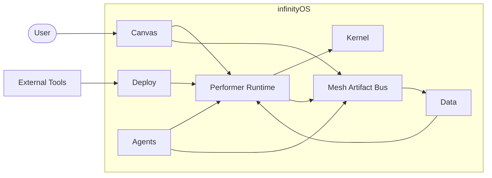
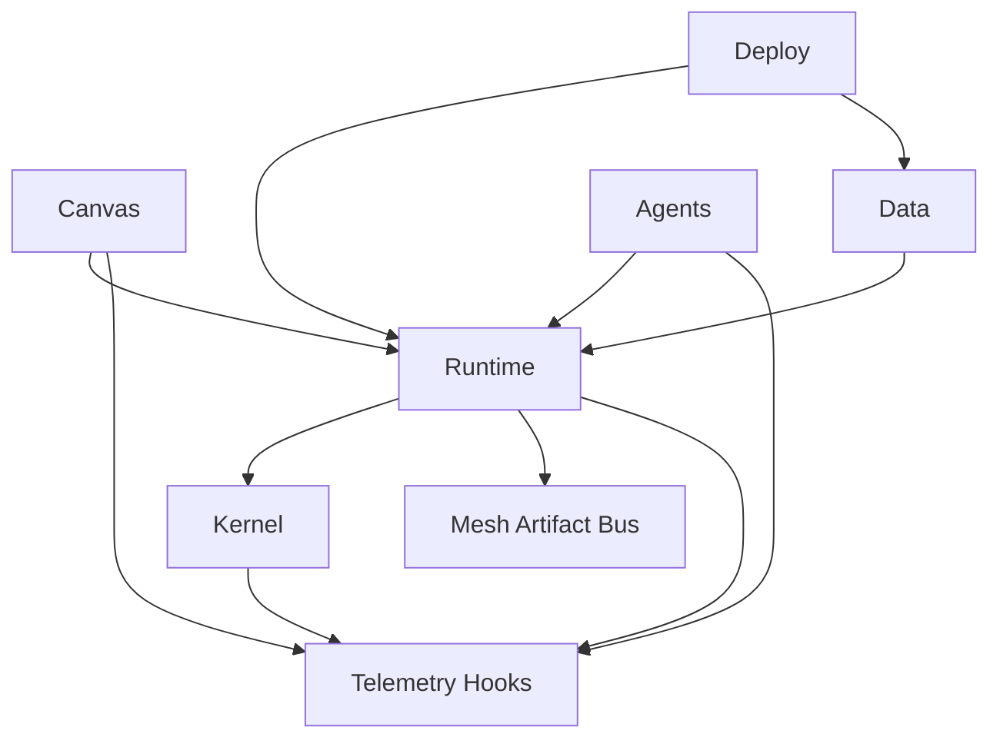

# infinityOS — AGENTS Operating Guide

This file defines **who builds what, when to build, and how to build** in infinityOS.

## 1) Project Intent

infinityOS is an operational system built around an **infinity zoom canvas** where:
- code is infrastructure,
- editor nodes connect and group into instances,
- dimensional `blockControllerGenerator` regimes coordinate execution,
- data pipelines are designed for robust, Kaizen-style continuous optimization.

Core implementation split:
- **C**: kernel and low-level boost layer (performance-critical, system-facing paths).
- **Rust**: performer/runtime layer (safe orchestration, task execution, agent flows).

## 1.1 Architecture Foundation (Epic A)

### Layered Architecture Map
- **Kernel (C)**: memory, scheduling, boot, replication-kernel, and system-facing primitives. No dependencies.
- **Performer Runtime (Rust)**: orchestration and task execution. Depends on Kernel via FFI.
- **Canvas**: node graph, multiplex UI surfaces, and interaction contracts. Depends on Performer Runtime.
- **Data**: archive/store/transform pipelines and dataset governance. Depends on Performer Runtime.
- **Deploy**: deployment adapters and workload targets. Depends on Performer Runtime and Data.
- **Agents**: operational agents, templates, policies, and execution flows. Depends on Canvas and Performer Runtime.

### Module Boundaries & Dependency Rules
1. Dependencies flow downward only; no layer may depend on a layer above it.
2. Kernel exposes an ABI-stable surface consumed only by the Performer Runtime.
3. Canvas, Data, Deploy, and Agents integrate through the Performer Runtime; direct cross-layer calls are forbidden.
4. Cross-layer interfaces must be documented before implementation and tracked in TODO items.
5. Task identity and action logging are cross-cutting concerns and must be propagated through every layer.

### System Context Diagram


### Component Diagram


## 2) Agent Roles (Who)

### 2.1 Kernel Agent (C)
Owns:
- kernel primitives,
- memory/process/scheduling interfaces,
- boot sequence and service registry,
- replication-kernel for task-scoped workloads,
- low-level bridges enabling runtime execution.

Must guarantee:
- deterministic behavior under load,
- strict bounds checks and error returns,
- ABI stability for Rust integration,
- stable TaskID + correlation ID propagation.

### 2.2 Performer Agent (Rust)
Owns:
- orchestration runtime,
- agent task lifecycle and scheduling contracts,
- node graph execution, tool runner abstraction,
- mesh artifact read/write/subscribe flows.

Must guarantee:
- safe concurrency,
- typed contracts between modules,
- recoverable failure handling,
- idempotent orchestration (replay-safe actions).

### 2.3 Canvas Agent
Owns:
- mesh data canvas behavior,
- node/link/group/instance UX contracts,
- multiplex layout (agents window, project window, chat column, widgets/editors, node canvas),
- desktop-level snippet execution interfaces.

Must guarantee:
- stable node identity and references,
- deterministic graph serialization,
- clear user feedback for run/deploy operations,
- seamless editor-driven node add/customize flows.

### 2.4 Data Agent
Owns:
- archive/store/process/transform/manage layers,
- schema versioning and migrations,
- lineage/provenance and replay,
- dataset classification/transformation governance,
- retention and legal hold policies,
- tiered storage, deduplication, and encryption-at-rest requirements,
- IPFS-backed storage for TeraForms, contracts, licenses, certifications, and legal/regulatory documents,
- multimedia database interpretation with schema-driven automations,
- DeFi resource pooling, encapsulation, and circuit-based computation distribution across connected node networks,
- backup/restore workflows and integrity verification.

Must guarantee:
- backward-compatible data migrations,
- immutable event history where required,
- measurable throughput/latency budgets,
- artifact integrity checks,
- retention enforcement and restore readiness,
- audit-ready encryption and key management hooks,
- schema automation, retention, and circular analysis execution by predefined agents.

### 2.5 Reliability Agent
Owns:
- load testing and profiling,
- incident runbooks,
- Kaizen optimization loops,
- SLO monitoring and regression gates.

Must guarantee:
- regression detection before release,
- performance and resiliency reporting,
- chaos testing coverage for orchestrator + replication kernel.

### 2.6 Operational Agents (System)
Owns:
- end-user facing agent experiences inside multiplex UI,
- task planning, evaluation loops, and tool usage,
- domain packs: ML/model-builder/training, trading automation, integrations.

Must guarantee:
- explicit capability requests (least privilege),
- full ActionLog coverage and reproducibility,
- human-auditable execution plans.
- governance policy compliance (capability tiers, audits, release gates) per docs/governance/.

## 3) Core Concepts (What)

### 3.1 Dimensions
- A **dimension** is an isolated operational namespace that scopes tasks, artifacts, permissions, and UI context.
- All reads/writes must include `dimension_id`.

### 3.2 Task Identity (TaskID)
- Every task MUST have a **unique TaskID within a dimension**.
- Recommended format: `dim/<dimension_id>/<ulid>` (globally unique while remaining dimension-addressable).
- TaskID must be included in: ActionLog, mesh artifacts, node executions, telemetry spans.

### 3.3 ActionLog (Controller Action Registry)
- Every controller action must emit an **ActionLog event**.
- Minimum fields: `dimension_id`, `task_id`, `action_id`, `action_type`, `actor` (user/agent), `timestamp`, `payload`, `correlation_id`, `causation_id`.
- ActionLog must support: replay, audit, debugging, and determinism checks.

### 3.4 Mesh Artifact Bus
- Mesh is the cross-layer artifact channel for nodes, datasets, models, and execution products.
- Mesh supports: publish, subscribe, snapshot, diff/patch, provenance stamping.

## 4) Operational Agents System (How)

### 4.1 Multiplex Agents Window (10)
1. List active agents by dimension + capability tier.
2. Show per-agent parameters/tools/memory/task flow.
3. Start/stop/pause agent sessions.
4. Display ActionLog stream filtered by agent.
5. Provide task queue view + manual overrides.
6. Attach/detach tools (DB, HTTP, blockchain, model).
7. Pin important artifacts and notes.
8. Trigger evaluation/elevate loops.
9. Export agent session as reproducible bundle.
10. Enforce permission prompts and approvals.

### 4.2 Project Window (10)
1. Dimension selector + project metadata.
2. Graph/template browser (instances, subgraphs).
3. Dataset/model registry views.
4. Library/package manager view.
5. Deployment targets and environments.
6. Task history with filters (TaskID, status, agent).
7. Artifact timeline and provenance explorer.
8. Settings: quotas, policies, secrets.
9. Import/export of graphs and templates.
10. Health + SLO status widgets.

### 4.3 Chat Column (10)
1. Convert chat intent → structured plan.
2. Show plan diffs and approvals.
3. Inline references to TaskID, nodes, artifacts.
4. Execute partial plans and checkpoint.
5. Provide explainability (why actions happen).
6. Run evaluation prompts and summaries.
7. Offer safe tool-call previews (dry-run).
8. Support multi-agent deliberation.
9. Persist conversation as artifact with provenance.
10. Provide quick actions (create node, connect node, run graph).

### 4.4 Widgets + Editors (10)
1. Dockable widgets (telemetry, logs, queue).
2. Multi-editor sessions per block.
3. Interpreter attach per editor.
4. Snippet execution with sandbox.
5. Convert code → node template.
6. Node parameter editor + schema validation.
7. Artifact viewers (json/table/plots).
8. Diff viewer for graph and artifacts.
9. Hotkeys/command palette for operations.
10. Accessibility and navigation parity.

### 4.5 Node Canvas (10)
1. Infinite zoom navigation contracts.
2. Node add/connect flows from editor.
3. Node group/instance creation.
4. Real-time status overlays (running/failed).
5. Per-node timing and resource overlays.
6. Breakpoints/step execution controls.
7. Inspect mesh artifacts per node.
8. Undo/redo for structural edits.
9. Validate graph before run/deploy.
10. Playback of execution timeline.

### 4.6 Kernel Boot + Replication Kernel Responsibilities (10)
1. Boot init stages defined and logged.
2. Capability discovery and registry.
3. Service registry start/stop semantics.
4. FFI handshake with runtime versioning.
5. Replication kernel spawn policy per task class.
6. Resource caps and teardown guarantees.
7. Crash-only restart of services.
8. Kernel tracing hooks for telemetry.
9. Deterministic scheduling mode option.
10. Security boundary enforcement (syscalls/limits).

### 4.7 Orchestrator + Mesh Artifact Flows (10)
1. Submit task with TaskID + dimension.
2. Plan → node graph execution mapping.
3. Publish progress events + logs.
4. Retry/backoff/cancel semantics.
5. Idempotent action execution (replay safe).
6. Produce artifacts to mesh with provenance.
7. Subscribe nodes/agents to artifact updates.
8. Persist task state for recovery.
9. Emit telemetry spans correlated to TaskID.
10. Generate evaluation summaries as artifacts.

### 4.8 ML / Model-Builder / Training Agents (10)
1. Dataset ingestion + classification nodes.
2. Feature engineering pipelines.
3. Model builder node templates.
4. Hyperparameter tuning loop.
5. Pre-evaluation + evaluation + elevate workflow.
6. Metric tracking and dashboards.
7. Model registry + versioning.
8. Drift detection and re-train triggers.
9. Safe execution budgets (gpu/time).
10. Export deployable model artifacts.

### 4.9 Trading Automation Agents (10)
1. Strategy node templates.
2. Backtesting pipeline nodes.
3. Risk management policy nodes.
4. Execution engine connectors.
5. Market data ingestion + normalization.
6. Monitoring and alerting widgets.
7. Paper trading mode.
8. Compliance/audit artifacts.
9. Fail-safe shutdown policies.
10. Performance attribution reports.

### 4.10 Data / DB / Library Management Agents (10)
1. DB connection manager.
2. Migration planner and executor.
3. Query node templates (multimedia DB extensions + circuit-aware distribution).
4. ETL/ELT pipeline templates with schema automation hooks.
5. Data quality checks and circular analysis automation (predefined agents).
6. Library/package pinning.
7. Vulnerability/license scanning.
8. Dataset cataloging and tagging (versioned snapshots + semantic tags).
9. Retention and archival automation (tiered storage, deduplication, encryption-at-rest, IPFS pinning for legal/regulatory artifacts).
10. Backup/restore workflows with integrity verification and ingest/query/restore benchmarks.

### 4.11 Blockchain + HTTP Nodes/Agents (10)
1. HTTP request node with auth/retry.
2. Webhook receiver node.
3. Blockchain wallet/signing node.
4. Chain RPC node templates.
5. Event subscription/indexing node.
6. Transaction simulation/preflight.
7. Rate limiting and circuit breaker.
8. Secret management integration.
9. Deterministic test harness for connectors.
10. Compliance and audit logging.

### 4.12 Editor Snippet Execution (10)
1. Secure snippet runtime entrypoint for canvas nodes.
2. Snippet packaging format (code, deps, permissions, metadata).
3. Execution profiles (local, isolated, deployment-bound) with explicit boundaries.
4. Permission/capability model (fs/net/model access) with prompts.
5. Deterministic execution mode (seeded, pinned deps) for reproducibility.
6. Interpreter attachment API for editors (language servers + runtimes).
7. Sandbox escape tests and hardening checks.
8. Output artifact capture (logs, files, structured results).
9. Resource limits (cpu/mem/time) and preflight validation.
10. Snippet-to-node compiler (turn editor code into reusable node templates).

## 5) Build Timing (When)

Build and verify at these checkpoints:
1. **On every merge request** touching C, Rust, execution contracts, UI flows, or ActionLog schemas.
2. **Before release tagging** for any layer.
3. **After schema/interface changes** between C and Rust, and mesh artifact schemas.
4. **After performance-sensitive edits** to scheduler, memory, mesh routing, or graph runtime.
5. **Nightly** for integration + stress suites when CI is available.

## 6) Build Execution (How)

### 6.1 Kernel (C) Path
1. Configure build profile (`debug`, `release`, `perf`).
2. Compile kernel modules with warnings-as-errors.
3. Run static analysis and bounds checks.
4. Run kernel interface tests.
5. Run boot sequence tests.
6. Run replication kernel tests.

### 6.2 Performer (Rust) Path
1. Build runtime crates.
2. Run formatter, lints, and tests.
3. Validate node graph execution scenarios.
4. Validate tool runners (db/http/blockchain/model).
5. Validate ActionLog propagation.

### 6.3 Cross-Layer Integration
1. Verify C↔Rust ABI contracts.
2. Replay representative canvas workloads.
3. Run end-to-end agent task scenarios.
4. Validate mesh artifact flows.
5. Capture performance metrics and compare against baseline.

## 7) Suggested Repository Hierarchy

```text
/kernel-c/                 # C kernel + boost layer
/runtime-rust/             # Rust performer/runtime
/canvas/                   # node graph + mesh canvas logic
/data/                     # archival/storage/transform pipelines
/agents/                   # built-in agent templates and policies
/deploy/                   # deployment adapters and manifests
/tests/
  /unit/
  /integration/
  /perf/
AGENTS.md                  # root-level agent operating instructions
TODO.md                    # root-level A-Z epic roadmap
```

## 8) Operational Rules

1. **Contract-first changes**: define/adjust interfaces before implementation.
2. **No silent failures**: every runtime failure path returns actionable context.
3. **Performance is a feature**: benchmark critical paths for each significant change.
4. **Secure by default**: validate all external inputs at layer boundaries.
5. **Version everything**: graph schemas, APIs, node templates, and data transforms.
6. **Reproducible builds**: pin toolchains once build systems are introduced.
7. **Full ActionLog coverage**: no controller action is allowed without a log event.
8. **TaskID everywhere**: TaskID is mandatory in execution, artifacts, telemetry.
9. **Governance enforcement**: follow docs/governance policies for capability tiers, audits, dependency checks, interface compatibility, schema changes, model use, marketplace compliance, and incident response.

## 9) Definition of Done

A change is complete only when:
- implementation and tests pass for touched layer(s),
- integration behavior is validated for affected interfaces,
- performance impact is measured (if relevant),
- security/capability impact is reviewed (if relevant),
- TODO epic item(s) are updated with status and owner.
