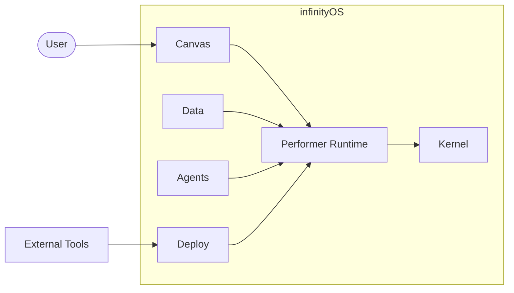
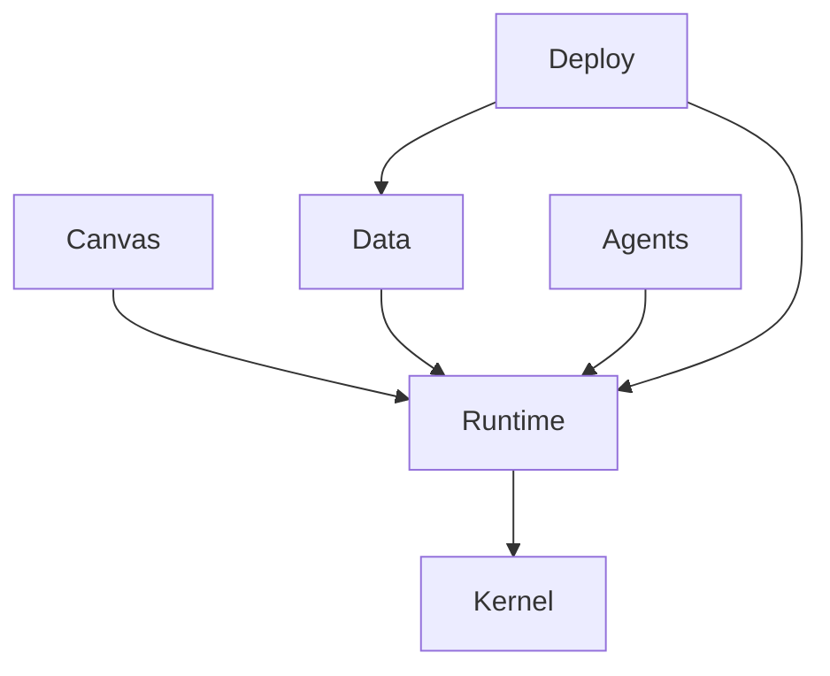

# infinityOS — AGENTS Operating Guide

This file defines **who builds what, when to build, and how to build** in infinityOS.

## 1) Project Intent

infinityOS is an operational system built around an **infinity zoom canvas** where:
- code is infrastructure,
- editor nodes connect and group into instances,
- dimensional `blockControllerGenerator` regimes coordinate execution,
- data pipelines are designed for robust, Kaizen-style continuous optimization.

Core implementation split:
- **C**: kernel and low-level boost layer (performance-critical, system-facing paths).
- **Rust**: performer/runtime layer (safe orchestration, task execution, agent flows).

## 1.1 Architecture Foundation (Epic A)

### Layered Architecture Map
- **Kernel (C)**: memory, scheduling, and system-facing primitives. No dependencies.
- **Performer Runtime (Rust)**: orchestration and task execution. Depends on Kernel via FFI.
- **Canvas**: node graph and interaction contracts. Depends on Performer Runtime.
- **Data**: archive/store/transform pipelines. Depends on Performer Runtime.
- **Deploy**: deployment adapters and workload targets. Depends on Performer Runtime and Data.
- **Agents**: templates, policies, and execution flows. Depends on Canvas and Performer Runtime.

### Module Boundaries & Dependency Rules
1. Dependencies flow downward only; no layer may depend on a layer above it.
2. Kernel exposes an ABI-stable surface consumed only by the Performer Runtime.
3. Canvas, Data, Deploy, and Agents integrate through the Performer Runtime; direct cross-layer calls are forbidden.
4. Cross-layer interfaces must be documented before implementation and tracked in TODO items.

### System Context Diagram


### Component Diagram


## 2) Agent Roles (Who)

### 2.1 Kernel Agent (C)
Owns:
- kernel primitives,
- memory/process/scheduling interfaces,
- low-level canvas execution bridges.

Must guarantee:
- deterministic behavior under load,
- strict bounds checks and error returns,
- ABI stability for Rust integration.

### 2.2 Performer Agent (Rust)
Owns:
- orchestration runtime,
- agent task lifecycle,
- node graph execution and deployment adapters.

Must guarantee:
- safe concurrency,
- typed contracts between modules,
- recoverable failure handling.

### 2.3 Data Agent
Owns:
- archive/store/process/transform/manage layers,
- schema versioning,
- lineage and replay.

Must guarantee:
- backward-compatible data migrations,
- immutable event history where required,
- measurable throughput/latency budgets.

### 2.4 Canvas Agent
Owns:
- mesh data canvas behavior,
- node/link/group/instance UX contracts,
- desktop-level snippet execution interfaces.

Must guarantee:
- stable node identity and references,
- deterministic graph serialization,
- clear user feedback for run/deploy operations.

### 2.5 Reliability Agent
Owns:
- load testing and profiling,
- incident runbooks,
- Kaizen optimization loops.

Must guarantee:
- SLO monitoring,
- regression detection before release,
- performance and resiliency reporting.

## 3) Build Timing (When)

Build and verify at these checkpoints:
1. **On every merge request** touching C, Rust, or execution contracts.
2. **Before release tagging** for any layer.
3. **After schema/interface changes** between C and Rust.
4. **After performance-sensitive edits** to scheduler, memory, or graph runtime.
5. **Nightly** for integration and stress suites when CI is available.

## 4) Build Execution (How)

Until full tooling is checked in, follow this target workflow:

### 4.1 Kernel (C) Path
1. Configure build profile (`debug`, `release`, `perf`).
2. Compile C kernel modules with warnings-as-errors.
3. Run static analysis and bounds checks.
4. Run kernel interface tests.

### 4.2 Performer (Rust) Path
1. Build runtime crates.
2. Run formatter, lints, and tests.
3. Validate node graph execution scenarios.
4. Validate deployment adapters.

### 4.3 Cross-Layer Integration
1. Verify C↔Rust ABI contracts.
2. Replay representative canvas workloads.
3. Run end-to-end agent task scenarios.
4. Capture performance metrics and compare against baseline.

## 5) Suggested Repository Hierarchy

```text
/kernel-c/                 # C kernel + boost layer
/runtime-rust/             # Rust performer/runtime
/canvas/                   # node graph + mesh canvas logic
/data/                     # archival/storage/transform pipelines
/agents/                   # built-in agent templates and policies
/deploy/                   # deployment adapters and manifests
/tests/
  /unit/
  /integration/
  /perf/
AGENTS.md                  # root-level agent operating instructions
TODO.md                    # root-level A-Z epic roadmap
```

## 6) Operational Rules

1. **Contract-first changes**: define/adjust interfaces before implementation.
2. **No silent failures**: every runtime failure path returns actionable context.
3. **Performance is a feature**: benchmark critical paths for each significant change.
4. **Secure by default**: validate all external inputs at layer boundaries.
5. **Version everything**: graph schemas, APIs, and data transforms.
6. **Reproducible builds**: pin toolchains once build systems are introduced.
7. **Kaizen loop**: each sprint must include at least one measurable reliability or throughput improvement.

## 7) Definition of Done

A task is complete only when:
- implementation and tests pass for touched layer(s),
- integration behavior is validated for affected interfaces,
- performance impact is measured (if relevant),
- TODO epic item(s) are updated with status and owner.
